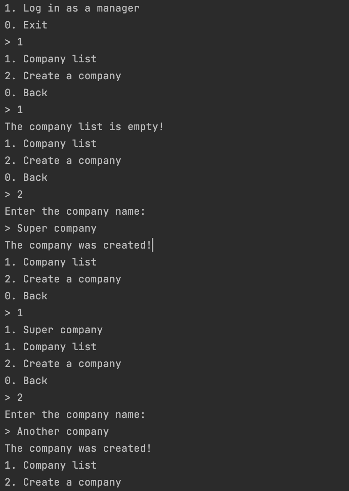

# Car Sharing

During the project implementation, I use the basics of SQL and work with the H2 database. You will also learn about advanced Java features such as Collections.

Car-sharing is becoming a more and more popular green alternative to owning a car. Let's create a program that manages a car-sharing service allowing companies to rent out their cars and find customers.

## Topics
 - Deep understanding of JDBC routines
 - Work with DB and DAO pattern
 - Read and write files form local file path
 - OOP programming with different classes
 - ArrayLists and Arrays manipulation
 - String and Integers manipulation
 - Algorihmic logic and structure 
 - Connection with SQL and H2 local databases
 - Add Search Delete Alter and Use Data for SQL and H2 data with SQL Queries
 - Strong use of loops and check methods in order to create menus and submenus for the user navigation
  

 
  

## Installation

Run -->
/Car Sharing/task/src/carsharing/Main.java
    
## Screenshots

